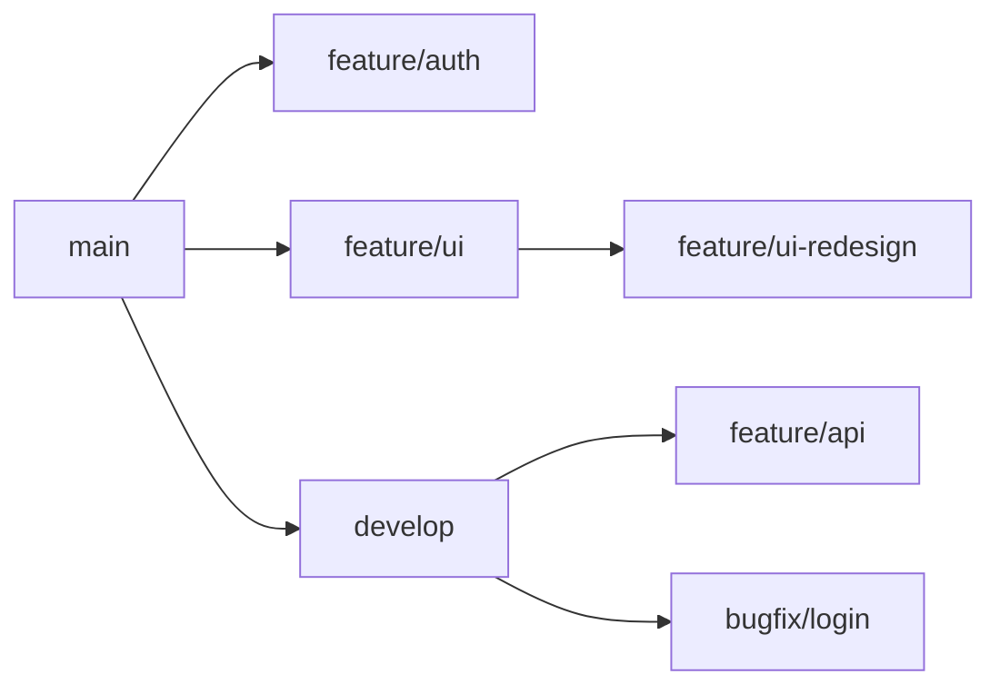
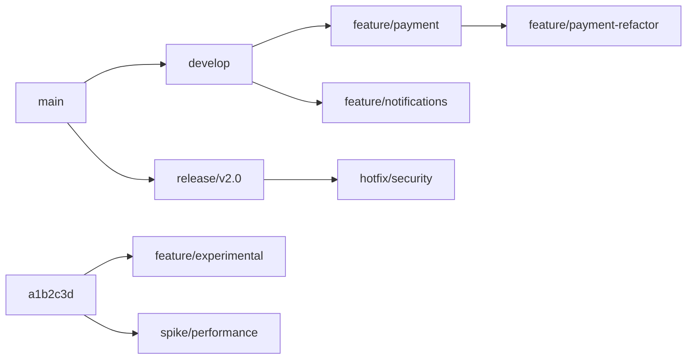
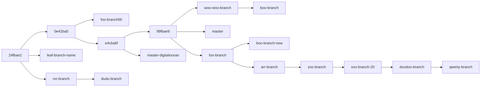
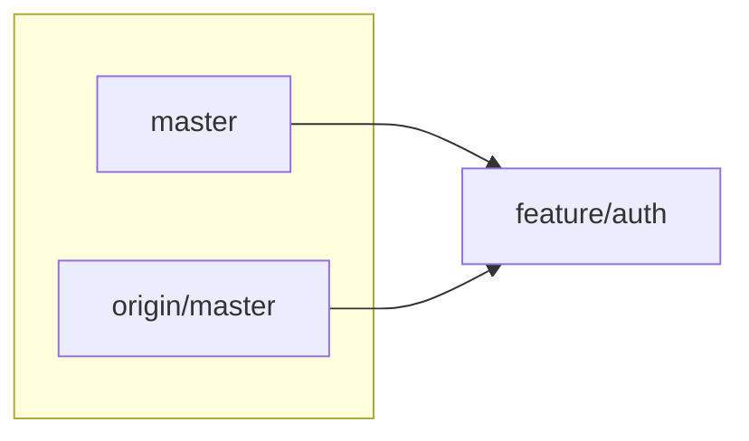

# git-branches-graph

A visualization tool that generates directed graphs showing the relationships between Git branches and their common ancestors.

## Overview

`git-branches-graph` analyzes your Git repository's branch structure and creates visual representations of how branches relate to each other through their merge-base ancestors. This helps understand the branching history and relationships in complex Git repositories.

## Features

- **Multiple output formats**: Mermaid, Graphviz DOT, CSV, PNG, and interactive HTML
- **Automatic branch detection**: Analyzes all local branches by default
- **Flexible input**: Specify branches explicitly or read from stdin
- **Transitive reduction**: Simplifies graphs by removing redundant edges
- **Smart labeling**: Uses branch names when ancestors are branch tips, otherwise shows commit hashes

## Usage

```bash
# Visualize all local branches (default Mermaid output)
./git-branches-graph

# Generate PNG image with Graphviz
./git-branches-graph --format png

# Analyze specific branches
./git-branches-graph main feature/auth feature/ui

# Output to specific file
./git-branches-graph --format dot --output branches.dot

# Process branches from git command
git branch | ./git-branches-graph --stdin

# Analyze repository in different directory
./git-branches-graph --repo /path/to/repo

# Include remote branches
./git-branches-graph --all

# [EXPERIMENTAL] Show all branches in clusters when they point to same commit
./git-branches-graph --all --cluster-same-commit

# Generate interactive HTML with pan/zoom capabilities
./git-branches-graph --format html --output graph.html

# Open HTML directly in browser (starts local server)
./git-branches-graph --format html --browser
```

## Options

- `-h, --help`: Show help message
- `-s, --stdin`: Read branch names from standard input
- `-a, --all`: Include remote branches in addition to local branches
- `-r, --repo REPO`: Path to Git repository (default: current directory)
- `-f, --format {mermaid,dot,csv,png,html}`: Output format (default: mermaid)
- `-o, --output OUTPUT`: Write output to file (auto-generates filename for PNG if omitted)
- `--cluster-same-commit`: [EXPERIMENTAL] Group branches pointing to same commit into clusters
- `--browser`: When using HTML format, start a local server and open in browser

## Example Output

### Mermaid Diagram

Here's an example of what the tool generates for a repository with multiple feature branches:



This visualization shows:
- `main` is the common ancestor of `feature/auth`, `feature/ui`, and `develop`
- `develop` branches into `feature/api` and `bugfix/login`
- `feature/ui` has a sub-branch `feature/ui-redesign`

### Real-World Example

For a more complex repository, the tool might generate:



Note: Commit hashes (like `a1b2c3d`) appear when the common ancestor isn't a branch tip.



## How It Works

1. **Branch Collection**: Gathers branch names from Git or user input
2. **Ancestor Discovery**: Finds merge-base for each branch pair
3. **Graph Construction**: Builds directed edges from ancestors to descendants
4. **Transitive Reduction**: Removes redundant paths for cleaner visualization
5. **Output Generation**: Formats the graph in the requested format

## Important Note about Multiple Branches on Same Commit

When multiple branches (local and/or remote) point to the same commit, only one branch name will be shown in the graph for that commit. This is because the graph uses commits as nodes, not branches. 

For example, if both `master` and `origin/master` point to the same commit, the graph will show only one of these branch names as the label for that node (typically the last one alphabetically). This behavior is particularly noticeable when using the `--all` flag to include remote branches.

## Experimental Features

### --cluster-same-commit Flag

This experimental feature addresses the limitation above by grouping branches that point to the same commit into visual clusters:

- **Mermaid**: Creates subgraphs containing all branch names
- **Graphviz/DOT**: Creates clusters with a gray background
- **Purpose**: Shows ALL branch names even when they reference the same commit
- **Usage**: `./git-branches-graph --all --cluster-same-commit`

Example output with clustering:


Note: This feature is experimental and may produce more complex graphs. It's particularly useful when you need to see all branch references clearly.

## HTML Output Format

The HTML output format creates an interactive visualization with the following features:

- **Pan and Zoom**: Use mouse wheel to zoom, click and drag to pan
- **Double-click**: Zoom to a specific point
- **Control buttons**: Zoom in/out, reset view, fit to screen
- **Keyboard shortcuts**: +/- for zoom, 0 to reset, F to fit
- **Full-screen view**: The diagram uses the entire browser viewport
- **Embedded Mermaid**: Uses Mermaid.js for rendering with svg-pan-zoom for interactivity

### Usage Examples

```bash
# Save to HTML file
./git-branches-graph --format html -o branches.html

# Open directly in browser (starts local server)
./git-branches-graph --format html --browser

# Combine with other options
./git-branches-graph --all --cluster-same-commit --format html --browser
```

The HTML template includes Font Awesome icons and provides a professional, interactive viewing experience for complex branch graphs.

## Requirements

- Python 3.6+
- Git
- Graphviz (optional, only for PNG output)

## Installation

The script is standalone and requires no installation. Just make it executable:

```bash
chmod +x git-branches-graph
```

## Tips

- Use `--format png` for quick visual inspection
- Pipe Mermaid output to documentation or GitHub README files
- Use CSV format for further processing with other tools
- Combine with `git branch --merged` to focus on active branches

## Troubleshooting

- **"Not in a Git repository"**: Run from within a Git repository or use `--repo`
- **Empty output**: Ensure you have multiple branches to compare
- **PNG generation fails**: Install Graphviz (`apt install graphviz` or `brew install graphviz`)
